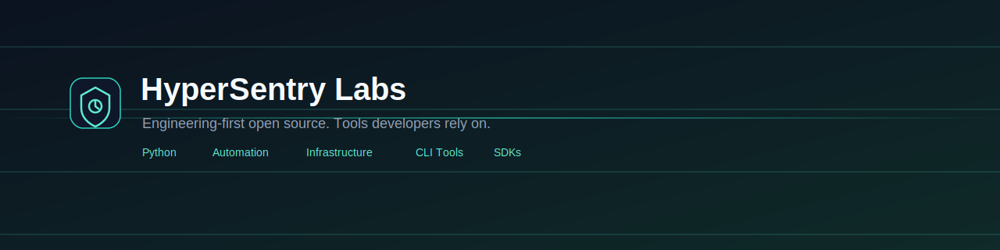

<picture>
  <source media="(prefers-color-scheme: dark)" srcset="assets/banner-dark.svg">
  <source media="(prefers-color-scheme: light)" srcset="assets/banner-light.svg">
  
</picture>

 

 

## About

HyperSentry Labs is an engineering-first open source organization. We build
backend systems, developer tools, automation, and infrastructure that are
meant to be run in production, not just demoed.

Our work spans Python libraries, CLI applications, SDKs, APIs, DevOps
tooling, AI-adjacent utilities, and FiveM development. Every project here
is built with the same underlying priorities: simplicity, reliability, and
long-term maintainability over short-term novelty.

## Engineering Philosophy

- **Simple over clever.** Code should be easy to read six months from now,
  including by someone who isn't its original author.
- **Boring in the right places.** Infrastructure and tooling should be
  predictable. Innovation belongs in the problem being solved, not in
  unnecessary abstraction.
- **Documentation is part of the deliverable.** A project without clear
  docs is an unfinished project.
- **Backward compatibility is a feature.** Breaking changes are
  deliberate, versioned, and documented — never accidental.
- **Security and performance are considered from the start**, not
  patched in after the fact.

## Core Values

<table>
<tr>
<td width="33%" valign="top">

**Reliability**

Software that behaves the same way in production as it did in
development, with clear failure modes when something does go wrong.

</td>
<td width="33%" valign="top">

**Maintainability**

Code, configuration, and documentation structured so that future
changes are safe and predictable to make.

</td>
<td width="33%" valign="top">

**Developer Experience**

Clear APIs, useful error messages, and documentation that respects the
reader's time.

</td>
</tr>
</table>

## What We Build

| Category            | Description                                                        |
| -------------------- | -------------------------------------------------------------------- |
| Backend & APIs        | Services and APIs designed around clear contracts and observability |
| Infrastructure & DevOps | Tooling for deployment, automation, and server management         |
| CLI Applications      | Command-line tools built for scripting and daily developer use     |
| SDKs & Libraries      | Reusable, well-documented building blocks for other projects        |
| Automation            | Bots and scripts that remove repetitive operational work            |
| FiveM Development     | Game-server modules and tooling for FiveM deployments               |

## Technologies

## Repository Standards

Every repository in this organization inherits the following from this
`.github` repository unless it defines its own override:

- A Code of Conduct, Contributing guide, and Security policy
- Issue forms for bugs, features, documentation, questions, and security
- Discussion templates for General, Ideas, Q&A, and Show & Tell
- A pull request template with a review and security checklist
- Shared CI workflows for linting, link checking, spell checking, and
  dependency management
- MIT licensing, unless a project explicitly states otherwise

See the [`.github`](https://github.com/hypersentry-labs/.github) repository
for the source of these defaults.

## Contributing

Contributions are welcome across all projects. Start with
[CONTRIBUTING.md](https://github.com/hypersentry-labs/.github/blob/main/CONTRIBUTING.md)
for the shared workflow, then check the specific repository you're
interested in for any project-specific notes.

If you're looking for a place to start, look for issues labeled
`good-first-issue` or `help-wanted` in individual repositories.

## Open Source Philosophy

We publish projects we use ourselves and intend to maintain. Code is
released under permissive licensing (MIT by default) so it can be used,
modified, and redistributed with minimal friction. We'd rather maintain a
smaller number of projects well than a large number poorly.

## Community

- **Discussions:** [github.com/orgs/hypersentry-labs/discussions](https://github.com/orgs/hypersentry-labs/discussions)
- **Issues:** opened on the relevant project repository
- **Security reports:** see [SECURITY.md](https://github.com/hypersentry-labs/.github/blob/main/SECURITY.md)

## Contact

For anything not covered by Issues or Discussions, reach out through the
organization's [`.github`](https://github.com/hypersentry-labs/.github)
repository.

 

© 2026 HyperSentry Labs · Released under the <a href="https://github.com/hypersentry-labs/.github/blob/main/LICENSE">MIT License</a>

